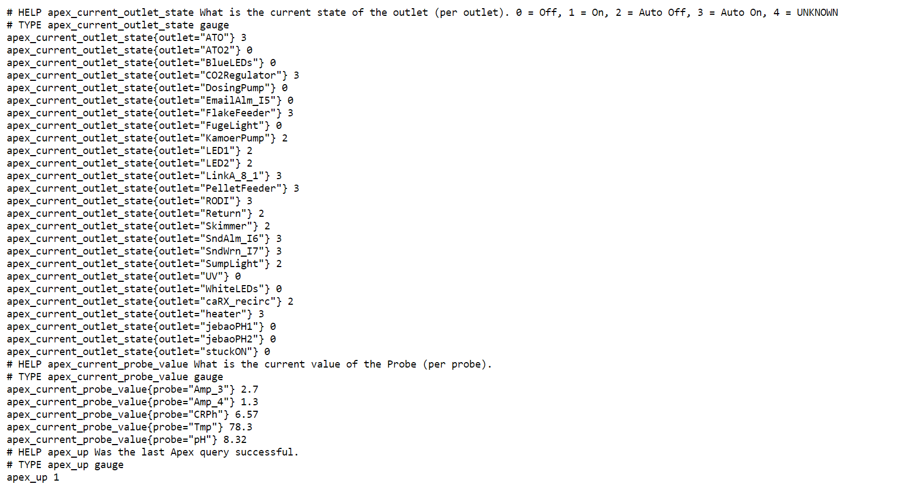
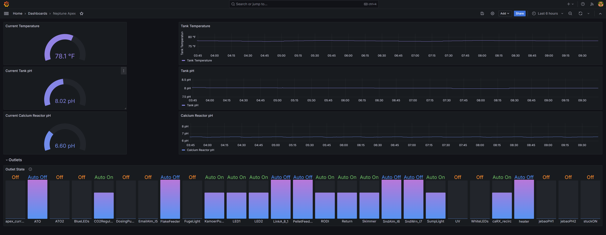

# Apex Exporter/Collector

## The Neptune Apex Promehteus exporter
This is a Promehteus metric exporter written in Golang for the Neptune Apex. It is heavily adapted from the [Mirth Channel exporter](https://github.com/teamzerolabs/mirth_channel_exporter) . It collects the metrics from status.xml on the Apex, parses the xml and exports the metrics in a format that Prometheus can scrape.



## Quickstart

```
# go build
# apex_exporter
```

## Configuration
Very little is needed to configure except the `.env` file that points to the local apex endpoint.

```
# cat .env 
APEX_ENDPOINT=http://192.168.0.218
APEX_USERNAME=admin
APEX_PASSWORD=1234
# 
```

## Prometheus
A small scrape job is needed in Prometheus:
```  
- job_name: 'apex'
    scrape_interval: 30s
    metrics_path: /metrics
    static_configs:
      - targets: ['exporter.example.com:9141']
        labels:
          apps: "apex"
```

## Grafana
Also included is a sample Grafana Dashboard `apex_dashboard.json`

